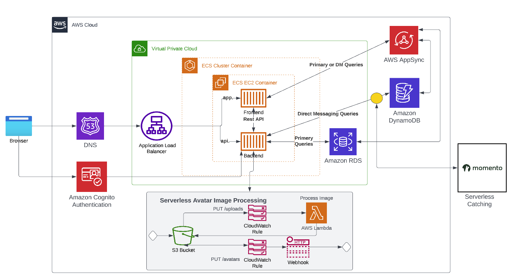
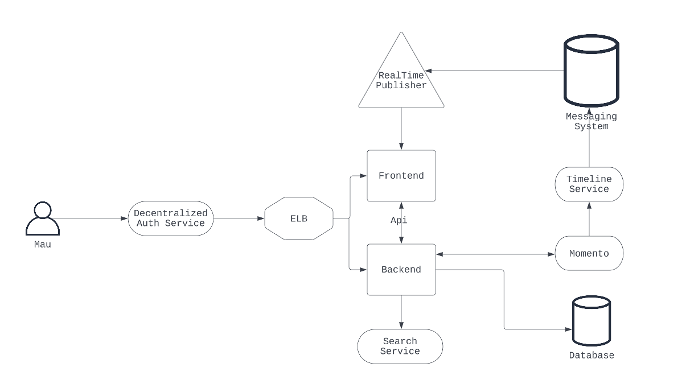
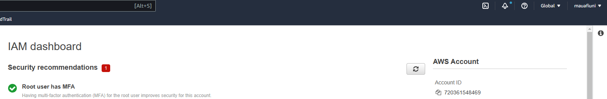
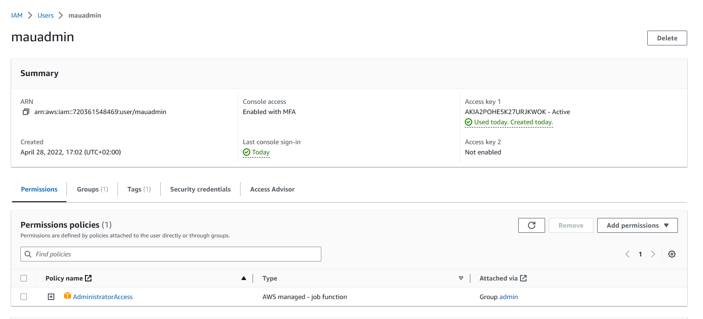
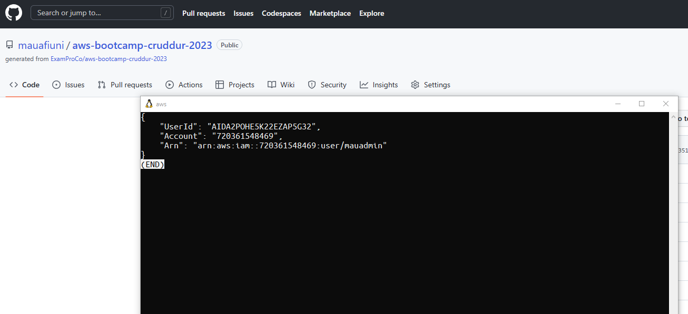
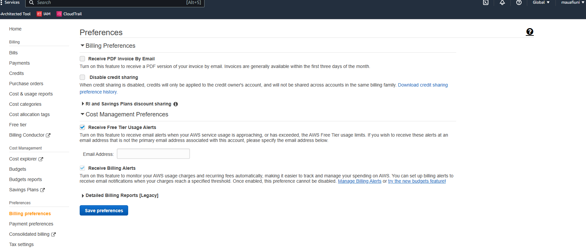
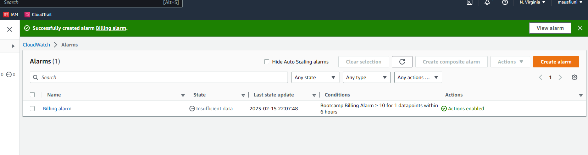
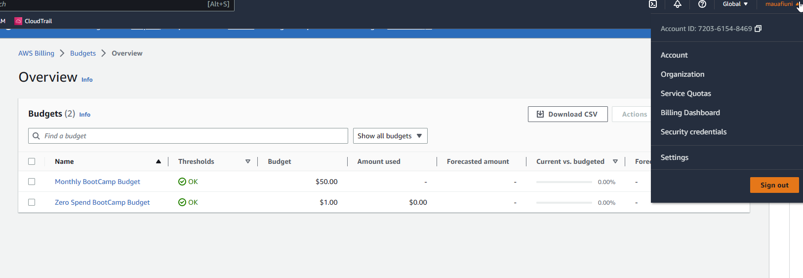

# Week 0 — Billing and Architecture

## Homework/Tasks

### Logical Architectual Diagram
[Lucid Logical Architectual Diagram](https://lucid.app/lucidchart/9c0358d6-b7ac-414d-917d-eb71c3316349/edit?view_items=QswxX-.E78NA&invitationId=inv_df6fab98-c925-4184-beee-e4e898991605).

### Conceptual Diagram
[Lucid Conceptual Diagram](https://lucid.app/lucidchart/d678d4dc-e8cd-48a7-8283-a9a79b408df5/edit?viewport_loc=-11%2C-11%2C2156%2C1065%2C0_0&invitationId=inv_5ea33d79-5064-45da-bbbf-12cc9390aaa6).

### Setup MFA

### Create a new User and Generate AWS Credentials

New Admin user created in AWS

I configured the AWS credentials to be used with WSL instead of Gitpod. I feel more confortable than the web experience

### Billing 

Enable billing

Billing alarm with email SNS topic

### Budgets

Configured budgets

